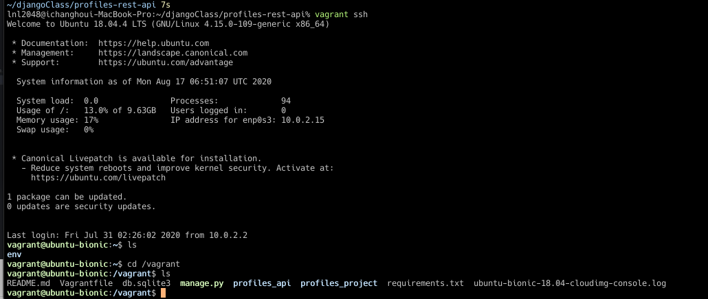

# Profiles rest api

practice rest api using django

개발 환경 (Vagrant 기반 가상환경)
1. vagrant init ubuntu/bionic64 --> 생성완료 
2. vagrant up
3. vagrant ssh --> 리눅스 환경 접속 



```
cd /vagrant 
// vagrant폴더 생성후 이동 
source ~/env/bin/activate 
// 파이썬 가상환경 사용
```
4. db 생성후 superuser 생성
```shell script
python manage.py createsuperuser 
// 이메일, 이름, 비밀번호 셋팅 (비밀 번호는 sook6836551)
```


